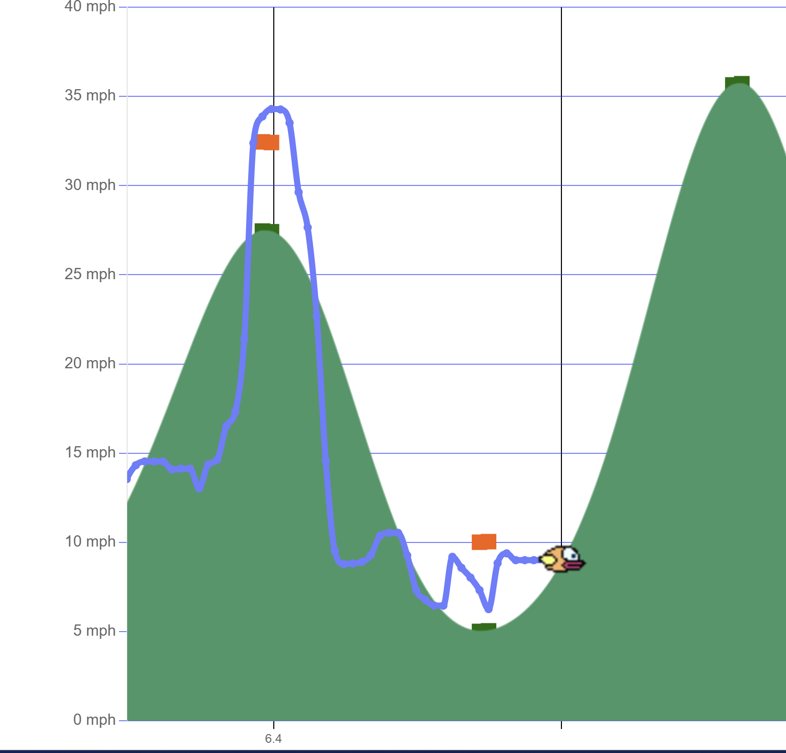

# Raspberry Pi Excercycle Logger and Monitor #

*now featuring FLAPPY BIRD web client*

This runs on a Raspberry Pi. It uses a Hall effect magnetic field sensor which detects a small fragment of
a rare earth magnet duct-taped to the reflector on a stationary bike I use for excercise in the winter.  

The Hall sensor allows a program on the Pi (`cyclogger.py`) to record the timing of the pulses to calculate
speed and etc.  Speeds are estimated assuming a 26-inch wheel.

Timings and estimated speed are recorded to daily csv files <del>as well as a sqlite3 database</del>[ed.: the sqlite database saving was disabled due to performance problems.

There is also code in there for a rudimentary ncurses display of speed vs. time. <del>It is now disabled in favor
of a web interface which is much easier to read</del>[ed.: the curses impmementatoin was restored due to the simple reality that I don't have an extra computer dedicated to serving as a monitor for my excercise bike.  I have an old VGA monior connected to the RPi -- it's only an RPi 2 -- so trying to run a web browser on X on the RPi 2 just didn't work.  Not enough processing power].

In support of the web interface, <del>I created a program (`websocketserver.py`) which serves the data in real time via a websocket
server.</del> [Ed.: The web socket interface was disabled due to the complexity of having to open two separate ports to the RPi. I started to do off-site demos of the web interface inconjunction with the replay script (explained below) and dealing with forwarding two ports was just too much of a pain.  It has been supplanted by having the web client have a simple function that reads the latest.json file directly using the web URL, and the using setTimeout to schedule the next read, up to 10 times per second.  You'd think that would bring the web server to its knees on that slow RPi2, but it works pretty smoothly.]

The data is transferred via an extremely primitive file interface.  [that it is!]  Every pulse record received by
the `cyclogger.py` program is immediately written the the file `_latest.json`, which it (atomically) renames to
`latest.json`.  Any client program can read the `latest.json` to get the latest available data.  Recall that when
a file in a Linux filesystem is deleted, while it is removed from the directory, the open file is actually kept intact
as long as any processes still have the file open. This allows client programs to retrieve an updated copy of the
latest available data, with no danger of having the data in the file drop out of existence while a client is reading the content.

Finally, the `www/index.html` and `www/flappy.html` files are two versions of a web page interface.

The index.html file is actually a Google Street View client.  It displays the chart showing speed and distance travelled, however, the main feature is the Google Street View interface.  Here's roughly how it works:

1. You need to edit the index.html file too supply starting lat/lon coordinates. Pick a bad spot and you can get stuck.

2. While the Street View is displayed, when you start cycling, ever few wheel rotations triggers a routine that moves the street view in the direction you are facing on the screen.  It uses the embedded directional arrows to move you. I tries to pick the arrow that is closest in degrees to where you are facing. If there are no forward facing arraows, it just keeps looking until it finds one.  If the only arrow it finds is exactly 180 from where you are facing, it will select that arrow.

3. As soon as it activates an arrow, it spins the viewer around to face in the directioh the arrow is pointing.

4. If you ever "get stuck" because there are no arrows pointing where you need to go and you end up bouncing back and forth between two or more views, you can alwats manually tap or double-tap the map display to "jump over" a gap in 3D panaorama locations.  [It appears that the automated arrow directions will only be generated if there is another 3D panorama within a short distance from where you are.]

5. THE TARDIS FEATURE.  If you have spent any time exploring an area with Google Street View you will have noticed that, due to there being imagery from different time frames oftem merged together in a given geographic area, it will often turn from summer to winter suddenly, or you'll see a building that is under construction suddenly appear completed, or vice-versa.  To mark these events, the street view web client will pop up an animation of the British Metropolitan Police Box, more popularly known as the TARDIS from Doctor Who.  Coincident with the animation, a short TARDIS sound is played.

6. If you are retracing the same steps over and over, you can use the mouse or a touch screen (MUCH easier when you are cycling!) to nudge the program to pick a different direction at an intersection.  You can also tap on a relatively distant street, or far down the street you are on, and Google Street View will teleport you there. [sorry, no TARDIS sound for that!]

7. Finally, I DID *NOT* come up with the idea of driving around in Google Street View using an exercise bike.  This idea I got from a scientific study that was done a few years ago. [Link to story is here](https://blog.google/products/maps/ride-remember-world-alzheimers-day/)  The quick summary is that for people with Alzheimer's and other disorders of memory, seeing neighborhoods that you lived in -- when growing up in particular -- can be a huge trigger of memory recall, and serve as an incentive to keep cycling.  I can recount from personal experience [even though I don't have Alzheimer's, I have Parkinsons, which can cause memory issues, but hasn't yet *knocks on wood* ] that when I virtually visited a town I last visted over 40 years ago (Camp Hill and Harrisburg, PA) when I was just 12 years old, I was able to remember the 7-mile-plus route to my violin teacher's house, and was able to pick out the exact house based on features of the layout of the house I rememebered from inside the house.  It was a huge motivator and I kept cycling for over an hour!  Typically I get super bored while cycling.  What a great invention! (Again, I DID *NOT* INVENT THIS, I simply recreated what others have done.)

Both programs open a connection to the <del>websocket server</del> repeatedly poll the `latest.json` file  and wait for new data to be written to the file <del>asynchronously over the
web socket.</del>  Upon <del>arrival of the data packets</del> reading new data, they update a client-side HTML5-Canvas based graph created using `Chartjs`.

<del>The anim-index.html file is a more updated version,</del> The standard `index.html` file now includes horizontal smooth scrolling using a
Kalman easing algorithm that can adapt to a range of speeds.  I had forked it from the earlier version in case it
took me more than 24 hours to get the new version going.  <del>No excuse to miss a workout, I could use the older non-animated
version until the new version was ready.</del>  If only I was that noble.  I fell off that wagon a couple years ago now.

<del>Note however, that the web socket server can only serve one browser session at a time.  Eventually i may
make the web socket server multithreaded so that it can serve more than one session.  This functionality
is obviously limited by the resources of the Pi. In addition, I don't forsee anyone else but myself having 
much interest in watching the data from my workouts on their screens in real time, so it's not a high priority.</del> Ahh, the innocent ideals of youth, back when I was just a young lad of 56. (I'm 59 about turn 60 as I write these updates.  I've found that simply serving the `latest.json` file directly using a good web server like apache or lighttpd is way more efficient than trying to mess with writing your own web socket server.

The real-time line/area chart scrolls from right to left, and shows a graphical record of your speed as if 
recorded by a pen plotter onto paper.

I also, for testing, created a program (replayserver.py) that reads in the csv from today's workout
and replays it in the same speed as it was originally recorded, by writing to the `latest.json` in the the same
threadsafe manner as the cyclogger.py program does.  This allowed me to spend some time testing the
web application, including timing-related issues, on actual data that I collected today.

<del>The program is hard-coded to only read today's file.  This is so when I get up in the morning, I am
forced to create my own data for testing.  No getting around the workout! </del>  Ah, more foolish idealism wasted on my salad days. I now not only go back and cherry pick a day where I actually cycled for more than 10 minutes without dying of boredom, I now put it in a loop so the same <del>5 minutes</del>[uh of course I meant 10 minutes.. um...]  get replayed over and over while I am sitting in my comfy chair far from the excercise bike writing and debugging this code.

And now the moment you have been waiting for...
